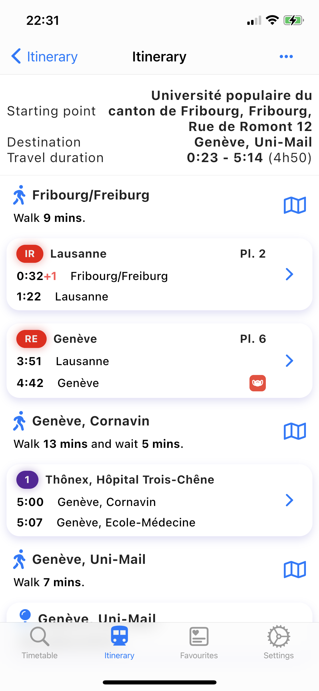

 

# Swift Travel - Travel swiftly

This is an open-source public transport app packed with cool features 😎

It features: 

⭐ A beautiful route search and view

 

⭐ A timetable

  

🤖 AI-powered smart suggestions

  

# Documentation

## Contributing 

### Guidelines

If you want to contribute, fork the repository and create a pull-request with your new feature, and make sure to:
 - Describe it well
 - Include **necessary tests**
 - Follow the coding style

### Adding support for a new country

 - Read [ADDING-NEW-API.md](doc/ADDING-NEW-API.md)

### Adding support for a new language

1. Create a new file named `intl_you_locale_code.arb` i.e `intl_de.arb` for German in `lib/l10n/`
2. Copy the content of the `intl_en.arb` to your newly create file and make sure to modify the `@@locale` field to the appropriate language.
3. Translate each field.

